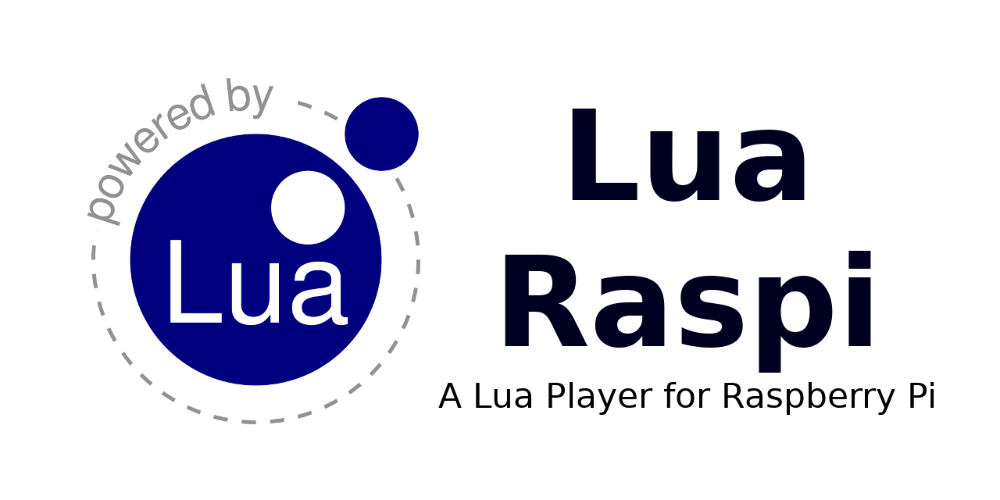

  

---

## Description

Lua Raspi is a Lua script embedded interpreter for the Raspberry Pi. If you are an amateur maker, with Lua Raspi you can make small proyects easier and faster on your Raspberry Pi. The system, which is based on Raspbian Lite, has been simplified and now inclides all necessary stuff to run your projects in Lua language.

## Snapshots

## Features

* A proyect explorer to launch lua scripts
* Function to load and draw/manipulate images

*work in progress...*

## Reference

All modules and functions are compiled in the [Lua Raspi Reference](https://nekerafa.github.io/Lua-Raspi/reference/index.html) page. For language reference, you can check the [Lua 5.3 Reference](https://www.lua.org/manual/5.3/manual.html) in the official page.

The C++ module wrappes are docummented in the [Lua Raspi C Reference](https://nekerafa.github.io/Lua-Raspi/doxygen/index.html) page.

## Downloads

*work in progress...*