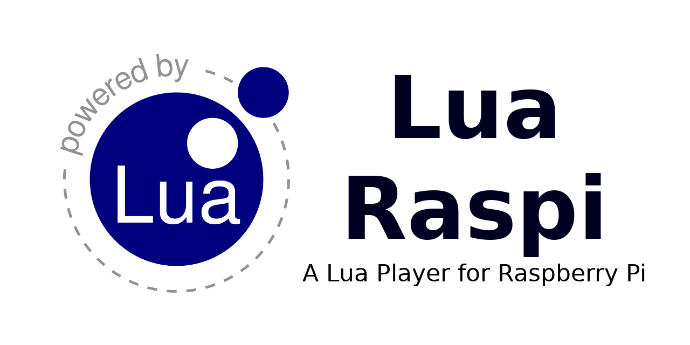

<p align="center"></p>

A Lua embedded interpreter for the Raspberry Pi. If you are an amateur maker, with Lua Raspi you can make small proyects easier and faster on your Raspberry Pi. The system, which is based on Raspberry OS Lite, has been simplified to inclides all necessary stuff to run your projects using Lua language.

<p align="center"><a href="www.lua.org"></a> <a href="github.com/NEKERAFA/LRaspi/releases"></a> <a href="github.com/NEKERAFA/Lua-Raspi/blob/master/LICENSE"></a></p>

---

## Dependencies

* [Lua 5.4](www.lua.org)
* [RayLib 3.7](www.raylib.com)

## Building

#### Ubuntu

You should install the tools: **GCC**, **make** and **cmake**; and the libraries: **ALSA**, **MESA** and **X11**

```bash
sudo apt install build-essential cmake git libreadline-dev libasound2-dev mesa-common-dev libx11-dev libxrandr-dev libxi-dev xorg-dev libgl1-mesa-dev libglu1-mesa-dev
```

Next, you can make the tool using the following commands:

```bash
git clone https://github.com/nekerafa/lraspi.git lraspi
cd lraspi
./build.sh
```

## Example

```lua
while isclosing() do
    screen.clear()
    screen:print("Hello world!", 10, 10)
    screen.flip()
end
```

## Reference

All modules and functions are compiled in the [Lua Raspi Reference](https://nekerafa.github.io/lraspi/reference/index.html) page. For language reference, you can check the [Lua 5.4 Reference](https://www.lua.org/manual/5.4/manual.html) in the official page.

The C module wrappes are docummented in the [Lua Raspi C Reference](https://nekerafa.github.io/lraspi/library/index.html) page.

## Downloads

You can see all releases in [GitHub Repository](https://github.com/nekerafa/lraspi/releases)

#### Last Release

* [2019-09-lraspi-0.0.2r.tar.xz](https://github.com/nekerafa/lraspi/releases/download/v0.0.2-alpha/2019-09-lraspi-0.0.2r.tar.xz)
* [2019-09-lraspi-0.0.2r.zip](https://github.com/nekerafa/lraspi/releases/download/v0.0.2-alpha/2019-09-lraspi-0.0.2r.zip)

---

### License

> MIT License
>
> Copyright (c) 2019 Rafael Alcalde Azpiazu
>
> Permission is hereby granted, free of charge, to any person obtaining a copy
> of this software and associated documentation files (the "Software"), to deal
> in the Software without restriction, including without limitation the rights
> to use, copy, modify, merge, publish, distribute, sublicense, and/or sell
> copies of the Software, and to permit persons to whom the Software is
> furnished to do so, subject to the following conditions:
> 
> The above copyright notice and this permission notice shall be included in all
> copies or substantial portions of the Software.
> 
> THE SOFTWARE IS PROVIDED "AS IS", WITHOUT WARRANTY OF ANY KIND, EXPRESS OR
> IMPLIED, INCLUDING BUT NOT LIMITED TO THE WARRANTIES OF MERCHANTABILITY,
> FITNESS FOR A PARTICULAR PURPOSE AND NONINFRINGEMENT. IN NO EVENT SHALL THE
> AUTHORS OR COPYRIGHT HOLDERS BE LIABLE FOR ANY CLAIM, DAMAGES OR OTHER
> LIABILITY, WHETHER IN AN ACTION OF CONTRACT, TORT OR OTHERWISE, ARISING FROM,
> OUT OF OR IN CONNECTION WITH THE SOFTWARE OR THE USE OR OTHER DEALINGS IN THE
> SOFTWARE.
